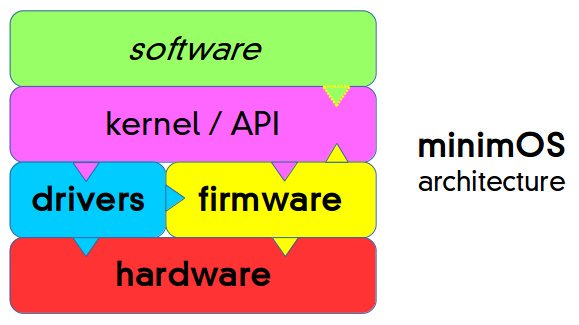

# minimOS architecture

*Last update: 2017-05-10*

## Rationale

**minimOS** (or *mOS* for short) is intended as a **development platform** for computers 
with *modest resources*. Its main goals are **modularity** (you choose whatever set of 
features you need) and **portability**: originally targeted to computers based on 
[**6502** CPU](https://en.wikipedia.org/wiki/MOS_Technology_6502) 
and derivatives, either commercial or home-made by retrocomputing enthusiasts, might 
be equally ported for almost any CPU out there including, but not limited to, Motorola 
[**6800**](https://en.wikipedia.org/wiki/Motorola_6800), 
[**6809**](https://en.wikipedia.org/wiki/Motorola_6809) & 
[**680x0**](https://en.wikipedia.org/wiki/Motorola_68000_series), 
Intel [**8080**](https://en.wikipedia.org/wiki/Intel_8080) /
[**8085**](https://en.wikipedia.org/wiki/Intel_8085) /
[Zilog **Z80**](https://en.wikipedia.org/wiki/Zilog_Z80) 
and the popular [**x86**](https://en.wikipedia.org/wiki/X86), 
plus the ubiquitous [**ARM**](https://en.wikipedia.org/wiki/ARM_architecture).

These goals will define most of its design features.

## Background

### Inspiration from CP/M

The *portability* goal takes some inspiration from the once popular 
[**CP/M**](https://en.wikipedia.org/wiki/CP/M),
the then *de facto* standard OS for microcomputers. While the original target (65xx) is 
contemporary with those systems, present-day computing expectations lead to several 
differences.

Perhaps this achieved goal was the key to CP/M's success. This OS had three main components:

- **BIOS** (Basic I/O system, *hardware dependent*)
- **BDOS** (Basic Disk OS)
- **CCP** (Console Command Processor)

Unlike the 
[**BIOS**](https://en.wikipedia.org/wiki/BIOS), 
which was provided *customised* by the computer's maker, 
all the remaining components were **generic**, as supplied by 
[Digital Research](https://en.wikipedia.org/wiki/Digital_Research). 
Of course, other commands or the *application software* were run atop of this, probably by 
temporarily *replacing the CCP* for increased available RAM, as this 
was a **single task**, single user OS. As soon as the task was completed, the *shell* (CCP) 
was reloaded and the user was prompted for another command.

Alas, this scheme is not complete: usually, these components were provided on some kind of mass-storage
media (often 
[*diskettes*](https://en.wikipedia.org/wiki/Floppy_disk)) 
that had to be *loaded* into RAM somehow, as no CPU has any means to execute code *directly* from 
[**secondary memory**](https://en.wikipedia.org/wiki/Auxiliary_memory). 
Thus, a small piece of **ROM** or any other *non-volatile 
[**primary** memory](https://en.wikipedia.org/wiki/Computer_memory)* 
was needed in order to load and run the Operating System. This was often a 
[**bootloader**](https://en.wikipedia.org/wiki/Bootstrapping#Computing) 
(generically known as 
[**firmware**](https://en.wikipedia.org/wiki/Firmware)) 
whose main purpose, besides the initial setup and perhaps some hardware tests 
([*POST, Power-On Self-Test*](https://en.wikipedia.org/wiki/Power-on_self-test))
was merely copying those three files in RAM and ordering the CPU to jump at their code. Obviously, 
this firmware was part of the computer's hardware, and had nothing to do with CP/M, save 
for being designed to boot from such system files. 

Apart from such firmware design, having an **Intel 8080** CPU or compatible (the only one 
initially supported by CP/M) and at least **16 KiB RAM** *starting at address $0*\* (plus some 
kind of **disk drive** for the DOS to work on) were the only requisites to any computer 
maker to have a **CP/M compatible** machine. With its notable software base, CP/M was *the* 
choice for many computer makers, at least in the office environment.

\*) A quick *hardware* note: since the i8080 CPU starts executing code *from address 0*, 
some **non-volatile** ROM is expected to be accesible at that address. But CP/M *needs* RAM there, 
thus some means to *switch off* ROM access from the bottom of the address map (once 
the firmware has done its task, of course) has to be provided to achieve CP/M compatibility... 
unless you want to *manually* program the initial RAM bytes via toggle-switches! Anyway, 
such a simple 
[*bank-switching*](https://en.wikipedia.org/wiki/Bank_switching) 
feature was easily implemented, as demonstrated by CP/M's sheer popularity.

Back in the day, the **I/O** capabilites of computers were rather limited: assume a *keyboard*, an *output device*
(could be a text CRT screen, but a 
[*teletype*](https://en.wikipedia.org/wiki/Teleprinter) 
would do) and/or a *printer*, plus some *mass-storage* devices, 
and you were set. Thus, the concept of modular 
[device **drivers**](https://en.wikipedia.org/wiki/Device_driver) 
as separate pieces of software was not relevant, and adapting your system to different 
peripherals meant the aforementioned **BIOS customisation** -- it wasn't *that* hard, anyway.

After the hayday of CP/M came the *x86-based* 
[**IBM PC**](https://en.wikipedia.org/wiki/IBM_Personal_Computer) 
running [**MS-DOS**](https://en.wikipedia.org/wiki/MS-DOS), 
itself pretty much inspired by CP/M, although the BIOS was somehow integrated into the firmware,
at least in an OS-independent fashion. For compatibility reasons, a 
[**jump table**](https://en.wikipedia.org/wiki/Branch_table) 
was provided for easily calling BIOS routines, no matter their actual 
locations in ROM; for additional performance, some software *skipped* this jump table, 
leading to a 
[plethora of incompatibilities](https://en.wikipedia.org/wiki/Influence_of_the_IBM_PC_on_the_personal_computer_market) 
whenever a *different from IBM's (copyrighted) BIOS* was used, but this soon ceased 
to be a problem, thanks to the development of highly compatible BIOSes thru 
[*clean room* design](https://en.wikipedia.org/wiki/Clean_room_design) techiniques, 
running on highly standardised PC *clones* of widespread use. ***The rest is history...***

### The home-computer market

On the other hand, the late seventies witnessed the birth of an unexpected computer 
market: the 
[*home computer*](https://en.wikipedia.org/wiki/Home_computer) 
which, despite the performance impairment, made computing affordable for the masses.

But bereft of the portability/standardisation features of CP/M (and later MS-DOS) machines, 
these were **closed, incompatible systems**, each platform gathering its base of loyal 
users. Despite this diversity, many systems became quite popular indeed: in USA, the 
[**TRS-80**](https://en.wikipedia.org/wiki/TRS-80),
the [**Commodore PET**](https://en.wikipedia.org/wiki/Commodore_PET), 
the [**Atari 400/800**](https://en.wikipedia.org/wiki/Atari_8-bit_family), 
and the [**Apple \]\[**](https://en.wikipedia.org/wiki/Apple_II); 
at the other side of the pond, the 
[**ZX Spectrum**](https://en.wikipedia.org/wiki/ZX_Spectrum),
the *powerful* [**BBC Micro**](https://en.wikipedia.org/wiki/BBC_Micro) 
(especially in UK schools) and, a bit later, the 
[**Amstrad CPC**](https://en.wikipedia.org/wiki/Amstrad_CPC)... plus the 
[**Commodore 64**](https://en.wikipedia.org/wiki/Commodore_64) 
(and its predecessor [**VIC-20**](https://en.wikipedia.org/wiki/Commodore_VIC-20)
) **anywhere** in the world, to mention the most relevant.

Despite their alleged technological advantage, the *Japanese* were off from this 
fierce price war but anyway they tried to make an *standardised* platform for it: the ill-fated 
[**MSX**](https://en.wikipedia.org/wiki/MSX) 
systems had some popularity in Japan, but much less in Europe and almost *zero* in America.

Substituting home cassette players for (then expensive) disk drives, these systems had 
a relatively ample ROM with not only the essential firmware and *kernel/BIOS* (sort-of), 
but usually featured a 
[**BASIC language interpreter**](https://en.wikipedia.org/wiki/BASIC), 
thus after booting (in just *a couple of seconds!*) one could simply 
**start typing programs**. *Many of us were taught Computer Programming (leading to 
formal education in Computer Science) this way...*

A pretty odd exception to this rule (in the UK) was the 
[**Jupiter ACE**](https://en.wikipedia.org/wiki/Jupiter_Ace), 
somewhat related to 
[*Sinclair*](https://en.wikipedia.org/wiki/Sinclair_Research) 
computers, but meant to be programmed... in 
[**Forth**](https://en.wikipedia.org/wiki/Forth_(programming_language)). 
This rather limited (1 KiB RAM + 2 KiB *VRAM*) machine 
played little role into the troubled waters of home computers, but made a point on the 
**extreme efficiency** of the little known Forth language.

Eventually, these home computers evolved into 16 or even 32-bit processors, like the 
[Apple IIgs](https://en.wikipedia.org/wiki/Apple_IIGS), 
[Atari ST](https://en.wikipedia.org/wiki/Atari_ST) &
[Commodore Amiga](https://en.wikipedia.org/wiki/Amiga),
although they were somewhat less popular as regular x86 PCs became less and less expensive.

## Generic *minimOS* architecture

### Overview

At first glance, **minimOS** architecture might look similar to that of CP/M,
but there are significant differences. Have a look at this graph:



Apparently, the **firmware** looks like the generic term for CP/M's *BIOS* -- together with the device **drivers**, 
which were implemented via *customisation*.

On the other hand, the **Kernel/API** seems certainly related to the *BDOS*, as is hardware-independent and 
providing the only interface *application software* is supposed to use... This component is probably the 
**closest one to CP/M's design**, in both form and function.

However, unlike CP/M's *BIOS*, minimOS' firmware (as of 2017-05-08) has **no I/O capabilities**, being restricted to 
**Kernel instalation/configuration** issues, plus providing a **standard interface to some hardware-dependent features** 
(say, *power management*). As this OS is intended to run on a wide spectrum of machines, from a simple embedded system 
to a quasi-full-featured desktop computer, **there is no guarantee of I/O device availability** at such low level. 
You can think of this as a ***Hardware Abstraction Layer***

On second thought, in case of a *Kernel and/or driver failure*, it would be nice to have 
an *emergency* I/O channel available for **debugging purposes**, provided the hardware 
allows it. For instance, a *Commodore 64* **has** a 40x25 text screen starting at $0400 
which could be easily used by debuggers, after a simple VIC-II initialisation. It, of 
course, is supplied with a **keyboard** for human input, too. Even if a 
particular computer lacks such convenient devices, a **suitable driver** provided by its 
*custom* kernel could "announce" its availability to the firmware, for its simple 
firmware I/O to work thru it. These won't be as reliable as the built-in devices in 
heavily crashed environments, but it's better than nothing. *The concept of separate 
**firmware drivers** has been considered*, but deemed too complicated.

### Device Drivers

As an essential feature of such device-agnostic OS, minimOS **driver architecture** has 
been carefully crafted for **versatility**. The details may vary depending on the CPU 
in use, but in any case they'll bear a **header** containing this kind of information:

- A device **ID** (currently 128-255, as *logical* devices use up to 127)
- A **feature mask** indicating the availability of some of the following
- Pointers to **initialisation** and **shutdown** routines (mandatory)
- Pointers to *character* **Input** and **Output** routines (when available)
- Pointers to ***block* Input** and **Output** routines (when available, TBD)
- Pointer to an **Asynchronous Interrupt Handler** (called *by request*, if enabled)
- Pointer to a ***Jiffy* Interrupt Handler** (called each ~5 ms, if enabled)
- Pointer to a ***Slow* Interrupt Handler** (called each ~1 s, if enabled)
- Pointer to a **description string** in human-readable form
- Number of ***dynamically allocated* bytes**, if loadable *on-the-fly* (TBD)

UPDATE 2017-05-10: The *jiffy* and *slow* interrupt tasks might be unified into a single *periodic interrupt queue*, adding a **frequency** parameter specifying how many 
*ticks* (jiffy interrupts) must wait in order to call the routine. For instance, 
a value of 200 would be equivalent to the *slow* interrupt task (5*200=1000 ms). 
*This is likely to be part of the standard for v0.6 and beyond*.
(END OF UPDATE)

*I/O routines* need little explanation, although **block** transfers haven't been used 
this far (2017-05-08). Details for them are TBD, and could serve as a **configuration** 
settings interface.

At boot time, the *initialisation* routine of each registered driver is **unconditionally** 
called -- if not needed, must point to an existing *Return from Subroutine* instruction. 
Upon exit, this routine must return an **error flag** indicating whether the driver was 
succesfully initialised or not (e.g. device not present), the latter condition making it 
**unavailable** for further I/O operation. Similarly, at shutdown/reboot every *shutdown* 
routine will be called, although any error condition makes little sense now, thus is not 
required.

Of special interest are the **interrupt routines**. The **jiffy** and **slow** tasks are 
called **periodically**; while 5 ms and 1 second (*see update below*), respectively, are the *recommended* 
values, the actual timing **cannot be guaranteed**. While the latter are obviously 
useful for infrequent tasks (disk auto-mount, long-lasting timers), the other may 
replace the [**daemons**](https://en.wikipedia.org/wiki/Daemon_(computing)) 
commonly seen on UNIX-like systems, perhaps with better responsiveness (quite an asset on 
low-spec machines) or even with no form of **multitasking** (which is, in any 
case, another *driver*) available!

Actual implementation may vary, but probably the most efficient way is having three 
**interrupt queues** (one for each kind: jiffy/slow/async) filled up at boot time *if* 
a driver provides such kind of interupt task *and* was succesfully initialised. Then, 
whenever the [ISR](https://en.wikipedia.org/wiki/Interrupt_handler) 
is called, if a *periodic* interrupt was the cause, the *jiffy* queue will be scanned, 
calling each entry sequentially (ditto for the *slow* queue, whenever some amount of 
jiffy IRQs happened).

UPDATE 2017-05-10: although *jiffy* & *slow* queues are to be unified, it's still worth 
keeping a separate *asynchronous* queue for **lower interrupt latency**. The new *adjustable frequency* method allows easy implementation of tasks that do not need to be executed *every* single jiffy IRQ. However, in case a driver needs 
*both* jiffy and slow interrupts, the unified interrupt task may start like this:

```
DEC delay          ; some internal counter
BNE fast_task      ; not expired, just execute jiffy task
    LDA #max_delay ; number of jiffys to be executed before the slow task
    STA delay
    JSR slow_task  ; execute slow task...
fast_task:         ; ...and continue with the usual jiffy task
```

For instance, in a system with 5 ms jiffy IRQ, a driver executing a periodic task every 20 ms *and* a slow task every second, would use `frequency = 4` and `max_delay = 50`.

A similar piece of code had to be used with "jiffy" tasks that hadn't to be 
executed every periodic IRQ, the new *frequency* parameter makes that **innecessary**.

Another improvement to this method would be the possibiliy of **temporarily disabling a certain interrupt task** when not needed, for better system performance.
(END OF UPDATE)

For the **asynchronous interrupts**, a similar procedure may be used, but each task 
must return an *error code* signaling whether the IRQ was acknowledged by that handler 
or not. This code **may or may not** be ignored by the ISR, depending on performance 
considerations or the chance of simaltaneous interrupts.

Please note that this system was designed with the (rather simple) interrupt system of 65xx processors in mind. 
*Hardware with more sophisticated interrupt management could use more 
queues to match their capabilities*.

In any case, the ocassional *interrupt masking* when entering 
[critical sections](https://en.wikipedia.org/wiki/Critical_section) may cause further 
delays. 

As of 2017-05-08, drivers **cannot be loaded *on-the-fly***, 
being **assembled together** with the Kernel, firmware etc. 
The problem is in *driver variables*, which are **statically allocated**. 
*Future versions will allow loading drivers from mass storage, even on a 
running system **without rebooting***. For this to be achieved, *dynamic allocation* of 
variable space is needed, thus a parameter in driver header asks for a certain memory 
size. Details for passing the allocated space *pointer* to the asking driver are TBD, (UPDATE 2017-05-10) 
but a feasible method in 65xx architectures would be **setting `sysptr`** 
reserved zeropage location prior to any interrupt task execution, pointing it to the 
beginning of allocated space. *Indirect indexed addressing* would have to be used 
by the drivers in order to access its (dynamically allocated) variable space. 
Alternatively, a *relocation* scheme (**not yet implemented** as of 2017-05-10, in any way) may be used for better runtime performance; even (for the 65816) moving 
*Direct Page* to the reserved area for the task execution, although that may 
interfere with *kernel calls* and general system operation, if not carefully crafted 
(interrupts **off**, and make sure NMI sets/restores DP accordingly).

---
 
*more coming soon*

