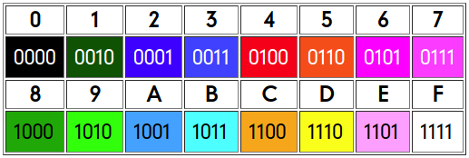

# Acapulco

The **Acapulco** project, formerly called _Tampico_, is a simple 65C02 computer with
**built-in _VGA-compatible_ video output**. Despite this output fitting a
_quasi-VGA_ format, actual picture resolution is _SD TV-like_ but compatible with
more modern devices. This also stays better within the limited power of a 65C02.

Another feature for both a more attractive display _and_ resource saving is the
ability to **display up to 16 colours** from a _fixed **GRgB** palette_, although
limited to _two of them over each 8x8 pixel region_, by means of an
**attribute area** (much like the one on the **ZX Spectrum**, although with no
`BRIGHT` or `FLASH` attributes.

As this machine lacks the _experimental_ aim of the **Jalapa 2** project,
no _configuration options_ will be available, although pin 1 on the CPU socket may
be used for **internal decoding disabling**. This may allow _piggybacking_ peripheral
cards, but is really intended for a **65816 card**, also in the making.

## Specs

Still within design phase, here is an outline of its basic specs:

- CPU: **65C02**
- Clock speed: **1.536 MHz** (although **1.5734375 MHz** might be preferred)
- VIA: single **65C22**, with the typical **piezo-buzzer** at `PB7-CB2`
- RAM: **32 kiB** (static) plus 1 kiB *shadow* RAM for attributes. 
- (E)EPROM: **32 kiB**
- Built-in video: **6445** based, 6845 may be used with extra multiplexing.

### Not provided on this machine

- Serial port
- Real Time Clock (of little use lacking a _filesystem_, although might be included)
- Hardware _zeropage/stack **bankswitching**_ (for multitasking, best to use the
_optional **65816 card**_)
- Expansion bus

## Clock generation

According to the usual way of selecting my _most abundant_ components in stock,
the clock signal is generated from a **24.576 MHz oscillator** can. However, the
specification of _VGA-compatible_ output suggests the industry-standard **25.175 MHz**
frequency; but some tinkering with the 6845/6345/6445 registers may achieve the
required compatibility. _Half_ of this frequency is used as **dot clock**, as it
will use _half the resolution_, both horizontal and vertical, of the VGA standard.

Further divided by 16 (via a **74HC161**), this signal will provide the main
**`Phi-2`** clock. This way, CPU accesses will be **interleaved** with
CRTC accesses for **optimum performance**.

## Video output

The main feature of the otherwise simple **Acapulco** computer is the VGA-compatible
**colour video output**. But since a complete _4 bpp full VGA_ display would need
at least _128 kiB of VRAM_, some measures must be taken in order to reduce the memory
and bandwith requirememts so they fit into the 6502's capabilities:

1) **Halving the resolution**, both H & V, down to those on the _home computers_
of old times, via **line doubling**.
1) The use of an **attribute area**, allowing the whole image to be stored like a
_bitmap_, limited to **two available colours _each 8x8 pixels_**.

These restrictions allow the whole VRAM area to fit into a mere **9 kiB** (1 for the
_attribute area_), subtracted from the regular SRAM as _vampire-video_. Supplied with
32 kiB of static RAM, this seems a reasonable approach.

The versatility of the **6x45 CRTCs** allow easy implementation of several video
modes. The choice of oscillator will affect compatibility, so some _timing tweaking_
should be used in case the _non-standard 24.576 MHz_ can is used. _Video driver_ may
thus provide several _configuration tables_, allowing these suggested modes:

- _for the **standard 25.175 MHz**:_
0) **320x200** (40x25 char.) **industry-standard** timing
0) **288x224** (36x28 char.) with elongated porchs (fully compatible)
0) **256x240** (32x30 char.) ditto, allowing a simpler driver

- _for the non-standard 24.576 MHz:_
3) **320x200** (40x25 char.) **much shorter back porch** (_perhaps_ compatible)
3) **320x200** (40x25 char.) **much shorter sync** pulse (likely compatible)
3) **288x224** (36x28 char.) most likely compatible with _slightly_ faster timing
3) **256x240** (32x30 char.) ditto, allowing a simpler driver
3) **320x200** (40x25 char.) shorter _back porch & sync pulses_ (most likely compatible)

_Firmware_ may provide a module for **quick video mode selection** during startup.

6x45's _raster addresses_ are wired as the most significant bits. This allows fast
**hardware-assisted scrolling** (Amstrad-like). It also sets a _constant distance_
(`$400`) between the _colour RAM_ and the upper raster of each displayed character,
greatly simplifying the driver.

### VGA compatibility and the 6845

As previously metioned, fully VGA compatibility can only be achieved thru the use of
a standard 25.175 MHz oscillator. The project is to be made using a 6445 CRTC and no
further issues should occur; however, in case a classic 6845 is used, another problem
can arise: it produces a **fixed length** (16 lines) _vertical sync_ pulse, which
may throw off the vertical position of the image a bit. _This might be an issue on the
256x240 mode_, as the whole 480 image lines are used, and some monitors may not have
room enough for top or bottom lines under such displaced `VSYNC` pulse. A feasible
workaround could be limiting such mode to _28 rows_ (224 raster lines).

On the other hand, the 6345/6445 can fine-adjust the `VSYNC` pulse length
_and_ position, thus highly recommended in any case. To keep the desired 6845
compatibility, this setting (together with those 6345/6445-specific ones)
**must be done by the Firmware** during _cold boot_, so the
OS _driver_ does not have to check for other than the **generic 6845 registers**.

### Video signal generation

Despite being a **4 bpp** screen, the use of an _attribute area_ makes VRAM
format as simple as a **bitmap** one. Thus, during CRTC addressing, RAM data is
latched into a **'165 shift register** as usual. However, instead of sending
its serial output directly to the VGA connector, it is used for _multiplexing_
the nibbles read from the _colour RAM_ (in parallel with the regular RAM), and
those 4 bits (representing either _foreground_ or _background_ color) are sent
to the _makeshift **DAC**_. The colour RAM output is, by the way, _latched_ at
the same time as the shift register.

_**Cursor** circuitry is TBD_, certainly with the assistance of the 6x45 hardware.
Most likely will involve some XOR gate between the shift register and the _colour
multiplexer_, actually swapping fore- and background colours (much like the ZX
Spectrum's `INVERSE` or `FLASH` modes). Ditto for **blanking**, not sure if via
some AND gate or by totally disabling the colour mux.

### Palette for the _Colour RAM_

For moderate bandwith and attractive presentation, a **GRgB palette** is used -- the
_green_ channel sporting **4 levels** isntead of two, as the human eye is most sensitive
to this one. The colour codes _for each character_ (or the corresponding **8x8 pixel**
area) are recorded with the most significant nibble representing the
_background_ one.

You can see the **GRgB palette** (among several discarded other ones)
[here](../other/grgb.html):

## Memory map

Within the usual 6502 restriction to 64 kiB address space, this machine is simply
defined as **32 kiB SRAM + 32 kiB EPROM**. From the latter, a full page (`$DFxx`)
is assigned to I/O devices -- although with quite a bit of mirroring.

Because of the _built-in video_ feature, some of the RAM is used as _VRAM_. **Colour
RAM** is, by the way, in a _separate **6116** chip_, but will be read by the CRTC only;
_writes on that area will be made **simultaneously on the 62256** too_, allowing
further reading by the CPU.

The standard memory map goes as follows:

- `$0000-$5BFF`: _62256_ **SRAM** (general purpose)
- `$5C00-$5FFF`: **Colour RAM** (**1K used** from a separate _6116_)
- `$6000-$7FFF`: **Video RAM** (stored in the _62256_)
- `$8000-$DEFF`: EPROM (**kernel & firmware**, plus any desired apps)
- `$DF00-$DFFF`: built-in **I/O** (NON selectable, but maybe _switchable_?)
- `$E000-$FFFF`: EPROM (continued kernel & firmware, including _hardware vectors_)

Decoded via a '139, the **I/O page** supports just **four** internal devices
with a 32-byte area each (decoding address lines `A5-A6`), mirrored on the
lower half of the I/O page. Only two devices are included:

- **VIA** at `$DFFx` (actually $DFE0-$DFFF, also at $DF60-$DF7F)
- **CRTC** at `$DFCC-$DFCD` ($DFC0-$DFDF and $DF40-$DF5F)

Some mirroring could be reduced by taking `A4` to the VIA's `CS1` _active-high_
signal, limiting its appearances at the **nominal $DFFx** and $DF7x. The other
second half of the '139 may be used (taking A7) leaving undecoded the _lower half_
of the I/O page, but at the cost of increasing delays. **This is particularly critical
with the 6522 VIA** as 1 MHz parts may violate its `tACR` and `tACW` requirements.
_Using 2 MHz parts should provide adequate speed_, though.

Anyway, since a complete _expansion bus_ is not fitted, there is a chance to
**disable internal decoding** thru the _CPU socket_. Pin 1 (`VSS` or `/VP`)
may be connected via a jumper to the decoding `/EN` enable input (active low).
A _pull-down_ resistor will allow normal operation in case a W65C02S part is
used (which takes pin 1 as `/VP` output), but will not prevent a suitable
socket-installed card **disabling the built-in decoding** whenever an _external
I/O address_ is issued. This method allows a _65816 card_ to supply some
**extra memory** outside bank zero.

## Glue-logic implementation

Most of the ICs for decoding are **74HC688** and **74HC139**, as I own plenty of them.
As per **multiplexing the address lines** in order to share RAM access between the CPU
and the CRTC, the use of a 6445 waives the need for actual multiplexers. From the CPU
side, though, a couple of **74HC245** isolate this part of the address bus whenever the
CRTC ouputs are not tristated (during `Phi1`).

Please note that _the 6445 does NOT tristate its outputs_ until it is told so.
Thus, the Firmware MUST do that as soon as possible, and make certain that **no RAM is
accessed until its _tristate_ configuration**, in order to avoid _bus contention_.
The hardware will make sure that the CPU-side '245s are enabled when `Phi2` is high
AND `A15` is low, so ROM or I/O accesses during the very first cycles will not cause
any problems. **6502 does a (fake) stack access during RESET**, thus note the trick
on _Chip selection_ for a complete solution. _None of these solutions will be
actually needed if using a properly **multiplexed** 6845_.

Special consideration needs the 6116 **Colour RAM**. Wired (mostly) in parallel
with the regular 62256 SRAM, it is _write-only_ from the CPU side (it will read from
the 62256, which is always written with the same contents) thru another '245 (a '244
may be used as well) and _read-only_ for the CRTC (thru a suitable '374/'574 latch).

### RDY implementation

Note that this machine _does **not** negate RDY_ by itself, thus a _gentle_ pull-up
is connected to this pin on the CPU. Thus, _WDC parts_ should not worry about the
execution of `WAI/STP` opcodes, as long as the jumper is NOT set to provide `VSS` there.

### Chip Selection

_Unless noted otherwise, all '688s and '139s are enabled as long as **`/EN`**
(perhaps available at CPU socket pin 1) is held **low**._

- **`/IO`** (peripheral page): a '688 compares `A8-A15` to `$DF`
- **`/RD`** (read enable): a '139 takes `Phi2 (nA1)` and `R/W (nA0)`, output on `n/Y3`
- **`/WR`** (write enable): the same '139 for `/RD`, output on `n/Y2`
- **`ROM /CS`**: inverted `A15` for optimum speed
- **`ROM /OE`**: a '139 takes `/RD (nA1)` and `/IO (nA0)`, output on `n/Y1`
- **`RAM /CS`**: a _permanently\* enabled_ '139 takes `Phi2 (nA1)` and `A15 (nA0)`,
output is **negated** `n/Y3`
- **`/MUX`** (enable CPU RAM access): the same '139 as above, output on `n/Y2`
- **`RAM /OE`**: a '139 _enabled by `A15`_ takes `Phi2 (nA1)` and `/EN (nA0)`,
output is **negated** `n/Y3`
- **`VIA /CS2`**: a '139 enabled by `/IO`\*\*, takes `A6 (nA1)` and `A5 (nA0)`, output
on `n/Y3`
- **`CRTC /CS`**: the same '139 as above, output on `n/Y2`
- **`VIA CS1`**: direct to `A4` as previously stated
- **`/CRAM`** (colour RAM write): a '688 comparing `A10-A15` to the upper bits of `$5C`

\*) The _enable_ signal should be the **inverted `/RES`** signal, but _delayed_ at least
_5 clock cycles_, skipping fake stack access during RESET. Although an _RC-delayed `RESET`
signal has been considered_, perhaps the most recommended method would be the use of a
**'165 shift register**, easily wired up for an _delayed-by-8-cycles_ enable signal.

\*\*) Another '139 half may be used for enabling this one, taking `A7` and
`/IO` as *enable*, for **reduced mirroring** at some speed penalty. 

### RAM multiplexing

Since there is **no separate VRAM** on this machine (even the _colour RAM_ values
are read by the CPU _from the standard RAM_, written in parallel), adequate
multiplexing between CPU and CRTC addresses must be provided. The use of a
6345/**6445** (instead of the classic 6845/HD46505) with **tristate** outputs
eases the need for a _real_ '157-based multiplexer, relying on a couple of my
abundant '245s bus transceivers (acting as mere line drivers) instead. Note that
the ROM and peripherals are _directly connected to the CPU address lines_ and
thus not multiplexed at all.

Enabling the CRTC's outputs is as simple as connecting `Phi2` to the `LPSTB/TSC`
input. On the other hand, _the CPU bus cannot be simply enabled by this signal_.
In order to allow safe operation without _bus contention_, as previously stated,
the CPU addresses are enabled by the aforementioned `/MUX` signal. For this trick
to work, it is ESSENTIAL that **no RAM is accessed** (including stack) **until
the tristate option is activated**. _Read above about ways to achieve this,
thru proper enabling of the `RAM /CS` signal_. 

_Last modified: 20191130-2200_
